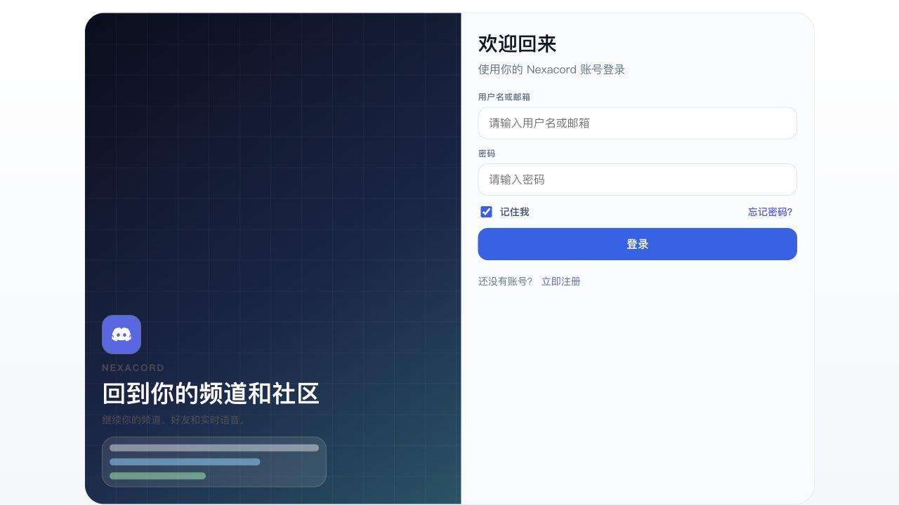
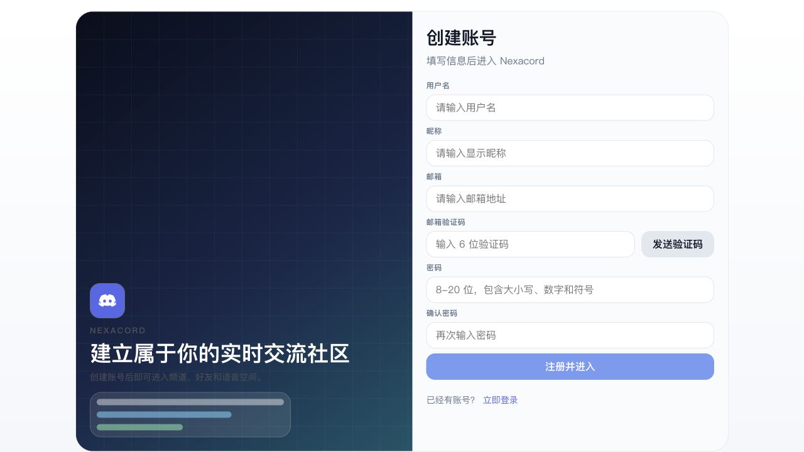
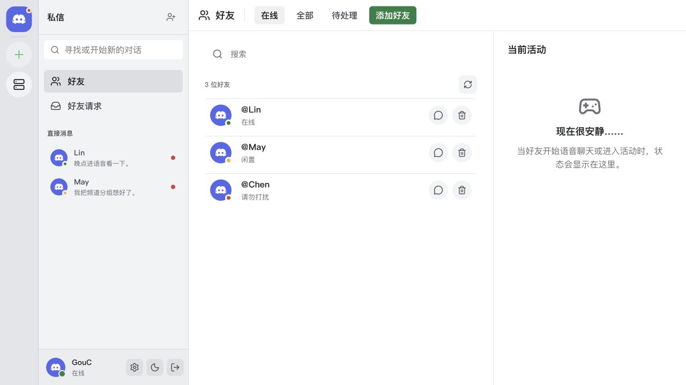
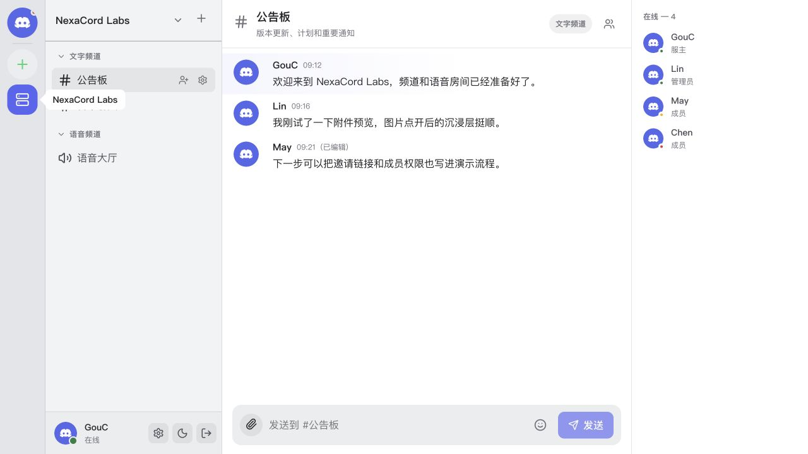
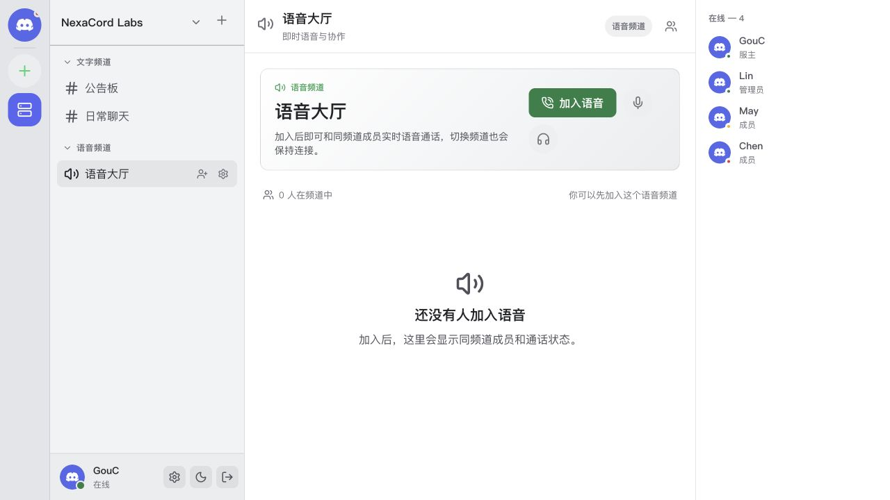

# NexaCord

<p align="center">
  <a href="../README.md">🇨🇳 简体中文</a> ·
  🇭🇰 繁體中文 ·
  <a href="README.en-US.md">🇺🇸 English</a>
</p>

NexaCord 是一個面向即時社群交流場景的全端聊天平台，提供接近現代社群工具的伺服器、頻道、好友、私訊和語音空間體驗。
專案包含 Vue 3 網頁端和 Spring Boot 後端，涵蓋帳號註冊登入、電子郵件驗證碼、JWT 工作階段、伺服器和頻道管理、文字訊息、圖片附件、好友關係、私訊會話、語音頻道、邀請連結和成員角色等功能。

## 目錄

- [展示截圖](#展示截圖)
- [核心功能](#核心功能)
- [技術棧](#技術棧)
- [專案結構](#專案結構)
- [環境需求](#環境需求)
- [快速開始](#快速開始)
- [設定說明](#設定說明)
- [開發檢查](#開發檢查)
- [安全說明](#安全說明)
- [貢獻](#貢獻)
- [授權](#授權)

## 展示截圖

<p align="center">
  <span>
    
  </span>
  <span>
    
  </span>
  <span>
    
  </span>
  <span>
    
  </span>
  <span>
    
  </span>
  <br />
  <sub>帳號登入</sub>
  &nbsp;&nbsp;&nbsp;&nbsp;
  <sub>帳號註冊</sub>
  &nbsp;&nbsp;&nbsp;&nbsp;
  <sub>好友首頁</sub>
  &nbsp;&nbsp;&nbsp;&nbsp;
  <sub>頻道聊天</sub>
  &nbsp;&nbsp;&nbsp;&nbsp;
  <sub>語音頻道</sub>
</p>

## 核心功能

- 帳號系統：支援註冊、登入、電子郵件驗證碼、密碼重設、密碼強度檢查和本機工作階段恢復。
- 工作階段安全：使用 JWT 與刷新權杖維護登入狀態，並支援帳號在其他裝置登入後的工作階段替換提示。
- 伺服器空間：支援建立伺服器、切換伺服器、維護伺服器資料、邀請成員和管理成員角色。
- 頻道組織：支援文字頻道、語音頻道和分類頻道，頻道列表會隨伺服器切換即時刷新。
- 文字訊息：支援頻道訊息載入、傳送、編輯、刪除、表情輸入和未讀狀態同步。
- 檔案附件：支援圖片選擇、上傳、預覽和多附件傳送，後端可接入七牛雲物件儲存。
- 好友與私訊：支援好友請求、好友篩選、私聊會話、私訊訊息和好友在線狀態展示。
- 語音頻道：支援加入/離開語音頻道、麥克風控制、遠端聲音控制和語音成員狀態顯示。
- 即時通訊：使用 STOMP over SockJS 推送訊息、頻道、伺服器、好友狀態和工作階段事件。
- 介面文件：後端整合 Springdoc OpenAPI，可在本機查看 Swagger UI。

## 技術棧

| 模組 | 技術 |
| --- | --- |
| 後端 | Java 17, Spring Boot 3.5, Spring Security, Spring Data JPA |
| 資料 | MySQL, Redis, Hibernate |
| 即時通訊 | Spring WebSocket, STOMP, SockJS |
| 鑑權 | JWT, Refresh Token, Spring Security Filter |
| 檔案儲存 | 七牛雲物件儲存 |
| 郵件服務 | SMTP 電子郵件驗證碼 |
| 前端 | Vue 3, TypeScript, Vite, Vue Router, Pinia |
| UI | Element Plus, Lucide Vue, 自訂 CSS |
| HTTP | Axios |

## 專案結構

```text
NexaCord/
├── nexacord-server/              # Spring Boot 後端服務
├── nexacord-web/                 # Vue 3 網頁端
├── docs/screenshots/             # README 展示截圖
├── i18n/                         # 多語言 README
├── nexacord_server.sql           # 服務端資料庫結構和可選初始化資料
└── README.md
```

## 環境需求

- JDK 17+
- Maven 3.9+，或使用 `nexacord-server` 內建 Maven Wrapper
- MySQL 8+
- Redis 6+
- Node.js 20+
- 可選：七牛雲物件儲存、SMTP 郵件服務

## 快速開始

### 1. 建立資料庫

```sql
CREATE DATABASE nexacord
  DEFAULT CHARACTER SET utf8mb4
  COLLATE utf8mb4_unicode_ci;
```

如需匯入初始化表結構和範例資料：

```bash
mysql -u root -p nexacord < nexacord_server.sql
```

### 2. 設定後端私有參數

後端預設會嘗試讀取 `nexacord-server/application-local.yml`。建議把本機資料庫、Redis、郵件、JWT 和物件儲存參數放在這個檔案裡，不要提交到倉庫。

```yaml
spring:
  datasource:
    url: jdbc:mysql://localhost:3306/nexacord?useUnicode=true&characterEncoding=utf-8&serverTimezone=Asia/Shanghai&allowPublicKeyRetrieval=true&useSSL=false
    username: your_mysql_user
    password: your_mysql_password
  data:
    redis:
      host: localhost
      port: 6379
  mail:
    username: your_mail_account
    password: your_mail_authorization_code

jwt:
  secret: replace-with-a-long-random-base64-secret

qiniu:
  access-key: your_qiniu_access_key
  secret-key: your_qiniu_secret_key
  bucket: your_bucket
  domain: your_cdn_domain

app:
  cors:
    allowed-origin-patterns: http://localhost:5173,http://127.0.0.1:5173
```

### 3. 啟動後端

```bash
cd nexacord-server
./mvnw spring-boot:run
```

Windows：

```powershell
cd nexacord-server
.\mvnw.cmd spring-boot:run
```

預設後端地址：`http://localhost:8080`

介面文件：`http://localhost:8080/swagger-ui/index.html`

### 4. 啟動前端

在 `nexacord-web/.env.local` 中指向本機後端：

```env
VITE_API_BASE_URL=http://localhost:8080/api
VITE_WS_BASE_URL=http://localhost:8080
```

啟動網頁端：

```bash
cd nexacord-web
npm install
npm run dev
```

預設 Vite 地址通常為 `http://localhost:5173`。

## 設定說明

- `nexacord-server/src/main/resources/application.yml` 保留預設開發設定，並透過環境變數支援覆蓋。
- `nexacord-server/application-local.yml` 適合放置本機私有設定。
- 前端本機開發必須設定 `VITE_API_BASE_URL`，否則會使用程式碼中的預設遠端 API 地址。
- `VITE_WS_BASE_URL` 應指向後端根地址，不帶 `/api`。
- 生產環境建議使用環境變數或獨立部署設定管理資料庫密碼、JWT 密鑰、郵件授權碼和物件儲存密鑰。

## 開發檢查

後端測試：

```bash
cd nexacord-server
./mvnw test
```

後端編譯：

```bash
cd nexacord-server
./mvnw -DskipTests compile
```

前端建置：

```bash
cd nexacord-web
npm run build
```

## 安全說明

- 不要提交資料庫密碼、郵件授權碼、JWT 密鑰、七牛雲 Access Key 或 Secret Key。
- `application.yml` 中的預設 JWT 密鑰只能作為開發備援，生產環境必須透過 `JWT_SECRET` 或私有設定覆蓋。
- 如果任何密鑰已進入公開倉庫，應立即吊銷並重新產生。
- 上傳檔案建議使用物件儲存和 CDN 域名，生產環境不要長期依賴本機檔案服務。
- CORS 只應放行可信前端網域，避免在生產環境使用過寬的來源匹配。

## 貢獻

歡迎提交 Issue 和 Pull Request。建議在提交前說明：

- 問題背景或功能目標
- 影響範圍
- 主要實作思路
- 已完成的測試或驗證步驟

## 授權

目前倉庫尚未宣告開源授權。若需要對外分發或接受貢獻，請先補充 `LICENSE` 檔案。
